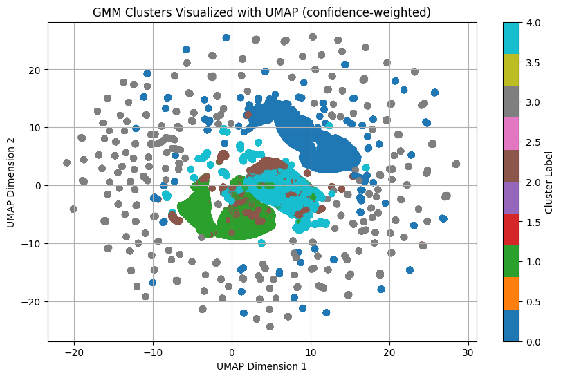
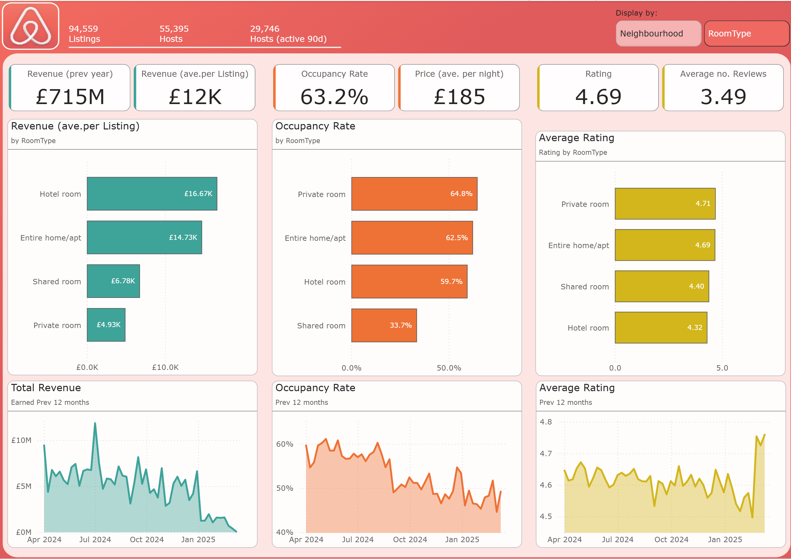

# DSPP Airbnb Analysis 🏡

This project showcases a data science pipeline built for the DSPP apprenticeship module. It ingests raw Airbnb data, processes it through a medallion-style architecture (Bronze → Silver → Gold), and delivers actionable insights via clustering, feature engineering, and stakeholder-ready visuals.

---

## 🔧 Pipeline Architecture

- **Bronze Layer**: Raw ingestion from CSV files (calendar, listings, reviews)
- **Silver Layer**: Cleaned and validated datasets with explicit NA handling
- **Gold Layer**: Aggregated features, clustering outputs, and business summaries

> ⚠️ Due to GitHub file size limits, raw data files in `data/bronze` are stored locally. All transformation logic is reproducible via the notebooks and scripts provided.

---

## 📁 Project Structure
├── data/ │
    ├── bronze/                    |# Raw data (excluded from repo)
    ├── silver/                    |# Cleaned datasets 
    └── gold/                      |# Final features and outputs 
├── notebooks/ 
    ├── bronze_ingestion.ipynb     |# Notebook producing Bronze layer data store
    ├── silver_prep.ipynb          |# Notebook prodicing Silver layer tables
    ├── silver_pre_goldchecks.ipynb|# QA Checks
    ├── gold_prep.ipynb            │# Notebook producing main Gold Tables
    ├── gold_visuals.ipynb         │# EDA visuals on GOld
    ├── ML_prep.ipynb              │# Feature Engineering for ML Clustering
    └── ML_GMM.ipynb               │# ML Clustering 
├── screenshots/                   │# For use in project
└── README.md

---

## 📊 Key Outputs

- **Clustering**: Gaussian Mixture Models to segment listings

- **Feature Engineering**: Host performance, room type breakdown, time series trends

- **Visuals**: Power BI dashboards and Python plots for stakeholder presentation

---

## 🎯 Business Impact

This pipeline supports:
- Host segmentation for targeted incentives
- Neighborhood-level investment insights

---

## 🧠 Skills Demonstrated

- ETL pipeline design with medallion architecture
- Modular, reproducible code with audit-friendly transformations
- Strategic EDA and feature engineering
- Business framing and stakeholder-ready outputs

---

## 📌 Notes

- Built as part of the DSPP apprenticeship program
- Raw data sourced from [Inside Airbnb](http://insideairbnb.com/)
- All code is documented for reproducibility

---

## 📄 License

This project is licensed under the MIT License.
